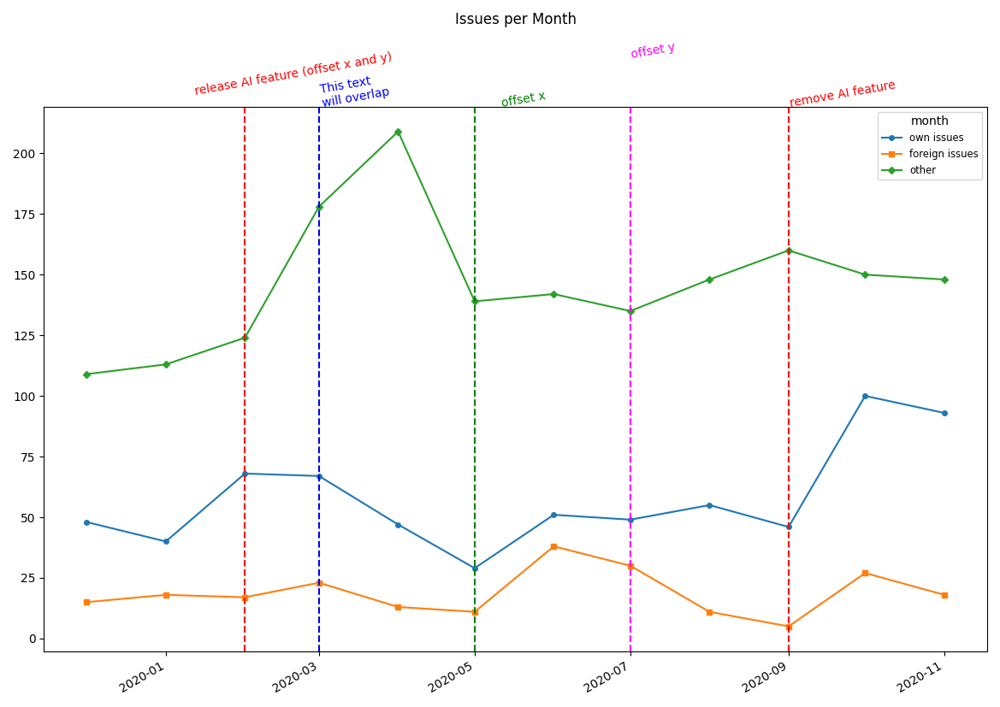

# csv2graph
This script generates a PDF graph from a CSV file.


## Description
This script generates a PDF graph from a CSV file.
It has two modes:
1. line graph (default)
2. pie chart

By default, the input is read from stdin and printed to stdout.  
You can also specify files with the `--input` and `--output` option.

When you use the `--output` option you can specify a different output format from PDF (e.g. png).

## line graph
Generate a line graph from the data.  
The first value of each line is used as a descriptive Label for the following data.
The first line must consist of dates 
according to the format specified in `--date-format` option (default: `%Y-%m`).
The dates can contain a label.
You can state the separator between the date and the label via `--x-label-separator`.
The date can contain the seperator. The script will find the right spot to split.

## pie chart
Generate a pie chart from the data.

## installation
You need to install these required packages: numpy, scipy, matplotlib  
Or use the requirements.txt file:
```shell
pip install -r requirements.txt
```

## usage & options
```
usage line: csv2graph [-h] [--input FILE] [--output FILE]
                      [--start-at-zero] [--threshold T] [--smooth] [--stacked] [--disable-markers]
                      [--data-in-columns] [--title TITLE] [--emphasize LABEL [LABEL ...]]
                      [--date-format FORMAT] [--x-label-separator SEPARATOR]
                      [--annotations FILE]
                      [--second-y-axis [AXIS]]
```
```
usage pie: csv2graph --pie-chart [-h] [--input FILE] [--output FILE]
                     [--data-in-columns] [--title TITLE]
```
```
optional arguments:
  -h, --help            show this help message and exit
  --smooth, -S          smooth data
  --stacked, -s         stacks data on top of each other. (Don't use with --second-y-axis).
  --start-at-zero, -z   force y-axis to start at zero
  --threshold T, -T T   print a threshold in the chart
  --pie-chart, -p       create a pie chart
  --input FILE, -i FILE
                        read data from this file instead of stdin
  --output FILE, -o FILE
                        print chart to this file instead of stdout
  --data-in-columns, -c
                        data is stored column-wise not row-wise
  --date-format FORMAT, -d FORMAT
                        set format for dates (default: %Y-%m)
  --x-label-separator SEPARATOR, --separator SEPARATOR
                        set separator between date and label
  --title TITLE, -t TITLE
                        set title
  --emphasize LABEL [LABEL ...], -e LABEL [LABEL ...]
                        emphasize Label by printing the line wider
  --annotations FILE
                        add annotations from file FILE
  --second-y-axis [AXIS]
                        Add second y-axis with different scaling.
                        Specify the axis for the dataset as a sequence of '1' or '2'.
                        (Don't use with --stacked.)
  --disable-markers, --no-markers, -m
                        disable markers on datapoints                  
```

## examples

### line
line.csv:
```csv
month,2019-12,2020-01,2020-02,2020-03,2020-04,2020-05,2020-06,2020-07,2020-08,2020-09,2020-10,2020-11
"own issues",48,40,68,67,47,29,51,49,55,46,100,93
"foreign issues",15,18,17,23,13,11,38,30,11,5,27,18
other,109,113,124,178,209,139,142,135,148,160,150,148
```

Command: 
```shell
./csv2graph --title "Issues per Month" -i examples/line.csv -o examples/line.pdf --date-format "%Y-%m" --emphasize "own issues"
```


### output png
Command: 
```shell
./csv2graph --title "Issues per Month" -i examples/line.csv -o examples/line.png --date-format "%Y-%m"
```


### Disable markers
Command: 
```shell
./csv2graph --title "Issues per Month" -i examples/line.csv -o examples/line_no_markers.png --date-format "%Y-%m" --disable-markers
```


### data in columns
If your data is column wise, you have to add the `--data-in-columns` option

line_columns.csv:
```csv
month,own issues,foreign issues,other
2019-12,48,15,109
2020-01,40,18,113
2020-02,68,17,124
2020-03,67,23,178
2020-04,47,13,209
2020-05,29,11,139
2020-06,51,38,142
2020-07,49,30,135
2020-08,55,11,148
2020-09,46,5,160
2020-10,100,27,150
2020-11,93,18,148
```
Command: 
```shell
./csv2graph --title "Issues per Month" --data-in-columns -i examples/line_columns.csv -o examples/line_columns.pdf --date-format "%Y-%m" --emphasize "own issues"
```


### Stacked data
You can stack the data.

Command: 
```shell
./csv2graph --title "Issues per Month" -i examples/line.csv -o examples/line-stacked.pdf --date-format "%Y-%m" --stacked --smooth
```


### line with labels
line_with_label.csv:
```csv
month,2019-12-dec,2020-01-jan,2020-02-feb,2020-03-mar,2020-04-apr,2020-05-may,2020-06-jun,2020-07-jul,2020-08-aug,2020-09-sep,2020-10-oct,2020-11-nov
"own issues",48,40,68,67,47,29,51,49,55,46,100,93
"foreign issues",15,18,17,23,13,11,38,30,11,5,27,18
other,109,113,124,178,209,139,142,135,148,160,150,148
```
Command: 
```shell
./csv2graph --title "Issues per Month" -i examples/line_with_label.csv -o examples/line_with_label.pdf --date-format "%Y-%m" --x-label-separator "-"
```
 

### line with annotations
You can add annotations to your graph.

In addition to the data csv file, you need a csv file with the annotations.

The text can contain newlines.

annotations.csv:
```csv
2020-02,2020-09
"release AI feature","remove AI feature"
```

Command: 
```shell
./csv2graph --title "Issues per Month" -i examples/line.csv -o examples/line_annotations.pdf --date-format "%Y-%m" --annotations examples/annotations.csv
```


#### data in columns
If your data is column wise, the annotations also have to be column wise

annotations_columns.csv:
```csv
2020-02,"release AI feature"
2020-09,"remove AI feature"
```
Command: 
```shell
./csv2graph --title "Issues per Month" --data-in-columns -i examples/line_columns.csv -o examples/line_annotations_columns.pdf --date-format "%Y-%m" --annotations examples/annotations_columns.csv
```


#### overlapping text
If your text overlaps, you can define an offset.

The first offset applies in x direction in the scale of the date.
(The dates are converted to a float representing dates in the unix epoche, 
[see matplotlib.date2num](https://matplotlib.org/stable/api/dates_api.html#matplotlib.dates.date2num)).
The second offset applies in y direction in the scale of the data.

annotations_overlap.csv:
```csv
2020-02,2020-03,2020-09,
"release AI feature","This text 
will overlap","remove AI feature"
```
Command: 
```shell
./csv2graph --title "Issues per Month" -i examples/line.csv -o examples/line_annotations_overlap.pdf --date-format "%Y-%m" --annotations examples/annotations_overlap.csv
```


annotations_offset.csv:
```csv
2020-02,2020-03,2020-05,2020-07,2020-09
"release AI feature (offset x and y)","This text
will overlap","offset x","offset y","remove AI feature"
-20,,10,,
5,,,20,
```
Command: 
```shell
./csv2graph --title "Issues per Month" -i examples/line.csv -o examples/line_annotations_offset.pdf --date-format "%Y-%m" --annotations examples/annotations_offset.csv
```


### 2 different y axis
You can use 2 different y-axis with different scaling.

If there are more than 2 datasets, you have to specify to which axis the dataset belongs,
with a sequence of `1` or `2`.

You can't use this together with `--stacked`.

Command: 
```shell
./csv2graph --title "Issues per Month" -i examples/line.csv -o examples/line-second-y-axis.pdf --date-format "%Y-%m" --second-y-axis 112
```


### pie
input-file:
```csv
"ips",64
"dns",22
"frontend",19
issue-1234,8
issue-9874,5
other,62
```
Command: 
```shell
./csv2graph --title "Most time consuming issues" -i examples/pie.csv -o examples/pie.pdf --pie
```


## Dependencies and Tests

The tests generate the examples and compare the results to the existing ones.
Unfortunately, the output depends on the matplotlib version.
That is why we pin all dependencies to a specific version using [pip-tools](https://pypi.org/project/pip-tools/).
