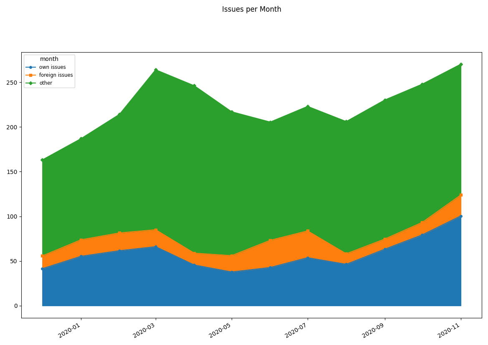

# csv2graph
This script generates a PDF graph from a CSV file.
It hast two modes:
1. line graph (default)
2. pie chart

By default, the input is read from stdin and printed to stdout.  
You can also specify files with the `--input` and `-- output` option.

## line graph
Generate a line graph from the data.  
The first value of each line is used as a descriptive Label for the following data.
The first line must consist of dates 
according to the format specified in `--date-format` option (default: `%Y-%m`).

## pie chart
Generate a pie chart from the data.

## installation
You need to install these required packages: numpy, scipy, matplotlib  
Or use the requirements.txt file:
```
pip install -r requirements.txt
```

## usage & options
```
usage line: csv2graph [-h] [--smooth] [--stacked] [--start-at-zero] [--threshold T]
                      [--input FILE] [--output FILE] [--emphasize LABEL [LABEL ...]]
                      [--date-format FORMAT] [--title TITLE] [--data-in-columns]
```
```
usage pie: csv2graph --pie-chart [-h] [--input FILE] [--output FILE]
                     [--data-in-columns] [--title TITLE]
```
```
optional arguments:
  -h, --help            show this help message and exit
  --smooth, -S          smooth data
  --stacked, -s         stacks data on top of each other
  --start-at-zero, -z   force y-axis to start at zero
  --threshold T, -T T   print a threshold in the chart
  --pie-chart, -p       create a pie chart
  --input FILE, -i FILE
                        read data from this file instead of stdin
  --output FILE, -o FILE
                        print chart to this file instead of stdout
  --data-in-columns, -c
                        data is stored column-wise not row-wise
  --date-format FORMAT, -d FORMAT
                        set format for dates (default: %Y-%m)
  --title TITLE, -t TITLE
                        set title
  --emphasize LABEL [LABEL ...], -e LABEL [LABEL ...]
                        emphasize Label by printing the line wider
```

## examples

### line
input-file:
```csv
month,2019-12,2020-01,2020-02,2020-03,2020-04,2020-05,2020-06,2020-07,2020-08,2020-09,2020-10,2020-11
"own issues",48,40,68,67,47,29,51,49,55,46,100,93
"foreign issues",15,18,17,23,13,11,38,30,11,5,27,18
other,109,113,124,178,209,139,142,135,148,160,150,148
```
Command: 
```shell
./csv2graph --title "Issues per Month" -i examples/line.csv -o examples/line.pdf --date-format "%Y-%m" --emphasize "own issues"
```


Command: 
```shell
./csv2graph --title "Issues per Month" -i examples/line.csv -o examples/line-stacked.pdf --date-format "%Y-%m" --stacked --smooth
```


### pie
input-file:
```csv
"ips",64
"dns",22
"frontend",19
issue-1234,8
issue-9874,5
other,62
```
Command: 
```shell
./csv2graph --title "Most time consuming issues" -i pie.csv -o pie.pdf --pie
```

